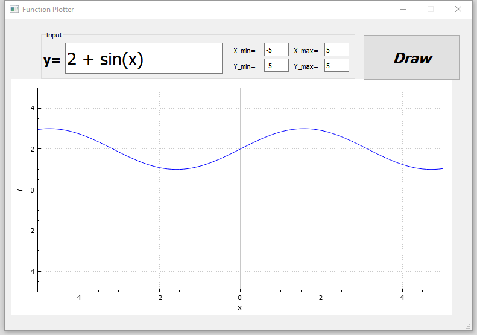

# Function Plotter
  
 Function plotter using QT 5 C++

## Enviornment
1- QT 5.15.2  
2- Compiler MinGW 32-Bit 

## Used Libraries
1- [QCustomPlot](https://www.qcustomplot.com/)  
2- [TinyExpr](https://github.com/codeplea/tinyexpr)

## Screenshots
[Screenshots](https://github.com/MostafaAkrsh/Function-Plotter/tree/main/Screenshots)
